# ETL con PostgreSQL

Este documento describe el flujo de datos para la Extracción, Transformación y Carga (ETL) de datos vectoriales, desde un entorno local basado en PostgreSQL hasta la plataforma de análisis y consumo de Inteligencia Artificial en la nube de Azure.


## 1 CREACIÓN DE BD Y CARGA DE DATOS EN POSTGRESQL

El objetivo es crear una Base de Datos Vectorial (pgvector) y cargar las imágenes del dataset FER2013.
Para ello, utilizaremos **Docker**, que tiene un contenedor con el servidor **PostgreSQL** y la extensión **pgvector** preinstalados.


### 1.1. CREACIÓN DE LA BASE DE DATOS Y LA TABLA

#### DESCARGA Y EJECUCIÓN DEL CONTENEDOR DOCKER (Pgvector)

Usaremos la imagen ankane/pgvector.

1.  **LIMPIEZA (Opcional):** Si tienes un contenedor previo llamado 'mi_postgres_pgvector' o el puerto 5433 en uso, elimínalo:

    ```powershell
        docker stop mi_postgres_pgvector
        docker rm mi_postgres_pgvector
    ```

2.  **EJECUTAR EL CONTENEDOR:** Ejecuta el siguiente comando en una sola línea en tu Terminal (PowerShell). Usamos el puerto **5433** en el host para evitar conflictos.

    ```powershell
        docker run -e POSTGRES_USER=<usuario> -e POSTGRES_PASSWORD=<contraseña> -e POSTGRES_DB=<nombre de la bd> --name <nombre del contenedor> -p 5433:5432 -d ankane/pgvector
    ```
    Esto tambien se puede hacer desde Docker Desktop. Para ello buscamos la imagen y luego iniciamos le contenedor con la misma configuracion que por comando.
    
    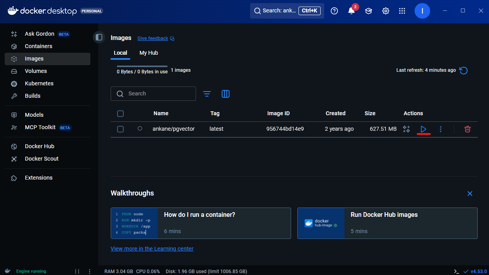
    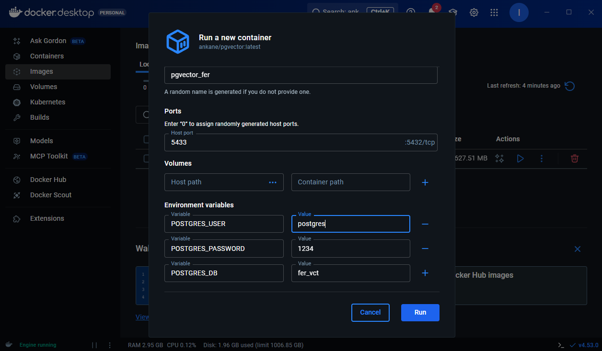

**DETALLES DE CONFIGURACIÓN**
* Puerto de tu PC (Host): `5433` (u otro en el que no este alojado ya algun servidor en postgreSql)
* Usuario/Contraseña: \<Tu usuario> / \<Tu contraseña>
* Base de datos creada: `fer_vct`

#### HABILITACIÓN DE LA EXTENSIÓN PGVECTOR

Una vez que el contenedor está corriendo, la extensión debe activarse en la base de datos:

1.  **CONECTAR A LA CONSOLA (Terminal):**
    ```bash
        docker exec -it <nombre del contenedor> psql -U <usuario> -d <nombre de la bd>
    ```
2.  **EJECUTAR SQL:** En 'fer_vct=#', escribe:
    ```sql
        CREATE EXTENSION vector;
    ```
    (Escribe \q y Enter para salir)

#### CONEXIÓN DESDE PGADMIN 4 Y CREACIÓN DE LA TABLA

1.  **CONEXIÓN EN PGADMIN:** Crea un nuevo servidor con la siguiente configuración:
    * Host name/address: `localhost`
    * Port (Puerto): `5433` (u otro en el que no este alojado ya algun servidor en postgreSql)
    * Username: \<Tu usuario>
    * Password: \<Tu contraseña>

2.  **CREACIÓN DE LA TABLA:** Una vez conectado a la base de datos 'fer_vct', ejecuta este SQL en la Query Tool. Usaremos 512 dimensiones, un tamaño común para embeddings generados por modelos como ResNet.

``` sql
CREATE TABLE imagenes_fer (
    id bigserial PRIMARY KEY, 
    filepath VARCHAR(255) NOT NULL, -- Ruta o nombre del archivo original
    emotion VARCHAR(50) NOT NULL, -- Etiqueta de emoción (ej: Feliz, Triste)
    vector VECTOR(512) -- Columna que almacenará el vector numérico
);
```


### 1.2. CARGA DE DATOS VECTORIALES (EMBEDDINGS)

#### EXPLICACIÓN DEL PROCESO DE CARGA

La base de datos vectorial solo almacena **vectores numéricos**, no imágenes. Por lo tanto, el proceso requiere un script de Python que:

1.  Utilice un **Modelo de Deep Learning pre-entrenado** (como ResNet) para extraer las características de cada imagen.
2.  Convierta esas características en una **lista de 512 números (el embedding)**.
3.  Utilice la librería **psycopg2** para enviar ese vector a la columna VECTOR(512) de PostgreSQL.

#### DATASET FER2013

El código está adaptado para procesar este dataset de expresiones faciales:

Enlace al Dataset: https://www.kaggle.com/datasets/msambare/fer2013/data

#### SCRIPT DE PYTHON (cargar_fer.py)

1.  **INSTALAR LIBRERÍAS:**
    ``` bash
        pip install psycopg2-binary numpy torch torchvision
    ```
2.  **SCRIPT:** Guarda el siguiente código como 'cargar_fer.py'. **¡IMPORTANTE!** Reemplaza la variable RUTA_DATASET con la ubicación real de tu carpeta 'train'.

```python
import psycopg2
import torch
from torchvision import models, transforms
from PIL import Image
import os
import glob 


# ¡IMPORTANTE! Reemplaza esto con la ruta donde está tu carpeta 'train' del dataset FER2013
RUTA_DATASET = 'C:/Ruta/A/Donde/Descargaste/fer2013/train' 

DB_PARAMS = {
    'dbname': 'fer_vct',
    'user': 'postgres',
    'password': '1234',
    'host': 'localhost',
    'port': '5433' 
}

# --- 1. CONFIGURACIÓN DEL MODELO DE EMBEDDING (ResNet18) ---
model = models.resnet18(weights=models.ResNet18_Weights.IMAGENET1K_V1)
model.fc = torch.nn.Identity() 
model.eval() 

transform = transforms.Compose([
    transforms.Grayscale(num_output_channels=3), 
    transforms.Resize(256),
    transforms.CenterCrop(224),
    transforms.ToTensor(),
    transforms.Normalize(mean=[0.485, 0.456, 0.406], std=[0.229, 0.224, 0.225]),
])

# --- 2. CONEXIÓN E INICIO ---
try:
    conn = psycopg2.connect(**DB_PARAMS)
    cur = conn.cursor()
    print("Conexión a la base de datos pgvector exitosa.")
except Exception as e:
    print(f"Error al conectar a la base de datos: {e}")
    exit()

# --- 3. PROCESAR IMÁGENES E INSERTAR VECTORES ---
total_images = 0
for emotion_folder in os.listdir(RUTA_DATASET):
    emotion_path = os.path.join(RUTA_DATASET, emotion_folder)
    
    if os.path.isdir(emotion_path):
        for img_path in glob.glob(os.path.join(emotion_path, '*.png')):
            
            try:
                # 1. Cargar y Transformar
                img = Image.open(img_path)
                input_tensor = transform(img)
                input_batch = input_tensor.unsqueeze(0)

                # 2. Generar el Vector
                with torch.no_grad():
                    embedding = model(input_batch).squeeze().numpy()

                # 3. Preparar para la DB
                vector_para_db = embedding.tolist() 
                relative_filepath = os.path.join(emotion_folder, os.path.basename(img_path))
                
                # 4. Insertar en pgvector
                insert_query = """
                INSERT INTO imagenes_fer (filepath, emotion, vector)
                VALUES (%s, %s, %s);
                """
                cur.execute(insert_query, (relative_filepath, emotion_folder, vector_para_db))
                total_images += 1
                
            except Exception as e:
                print(f"Error procesando {img_path}: {e}")
                continue

# --- 4. FINALIZAR TRANSACCIÓN ---
conn.commit()
cur.close()
conn.close()
print(f"--- Proceso Finalizado ---")
print(f"Total de imágenes procesadas e insertadas: {total_images}")
```
#### EJECUTAR EL SCRIPT

Navega a la carpeta del archivo 'cargar_fer.py' en tu Terminal y ejecuta:
```bash
python cargar_fer.py
```

## 2. Ingesta y Migración Inicial a la nube

Esta fase cubre la migración de la base de datos local 'fer_vct' a Azure Database for PostgreSQL - Flexible Server.
Se utilizarán las herramientas nativas de PostgreSQL: `pg_dump` y `pg_restore`.

### 1. PRERREQUISITOS IMPORTANTES

* **HERRAMIENTAS**: pg_dump y pg_restore deben estar accesibles desde tu terminal. Si no lo están, usa la ruta completa del ejecutable (Ej: "C:\Program Files\PostgreSQL\18\bin\pg_dump.exe").
* **FIREWALL DE AZURE**: La IP pública de tu máquina debe estar permitida en las reglas de Firewall de tu servidor Azure.
* **CREDENCIALES**: Ten a mano el Host Name, Usuario Administrador (<AZURE_ADMIN>) y la Contraseña de tu servidor de Azure.


### 2. EXPORTAR LA BASE DE DATOS LOCAL (pg_dump)

Se crea un archivo de respaldo en la carpeta donde hemos creado.

**COMANDO DE EXPORTACIÓN:**
```bash
    <RUTA_A_PG_DUMP> -h localhost -p 5433 -U postgres -Fc -d fer_vct > fer_vct_backup.dump
```

### 3. PREPARACIÓN EN AZURE POSTGRESQL

Primero tenemos que haber desplegado el servicio de Azure Sql for PostgreSQL. En la version de postgre, podremos la misma que tenemos en local.

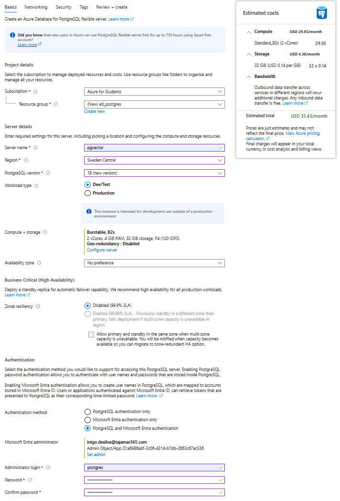

Luego en la seccion de `Networking` vamos a marcar las casillas que estan marcadas en la imagen y vamos a añadir nuestra ip publica para poder acceder desde nuestro equipo.

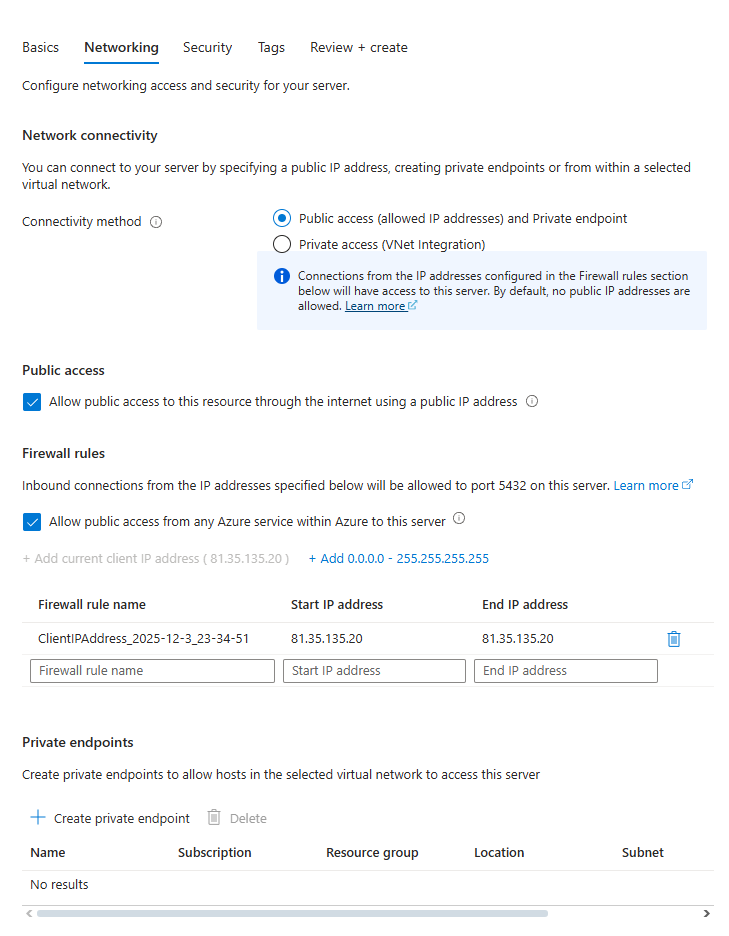

#### PERMITIR LA EXTENSIÓN EN EL PORTAL DE AZURE (**IMPORTANTE**)

Tienes que modificar un parámetro del servidor para indicarle a Azure que el usuario administrador puede habilitar esta extensión (pgvector). Este paso es obligatorio en Azure Flexible Server.

1. NAVEGA AL SERVIDOR: Ve al Portal de Azure y selecciona tu servidor PostgreSQL llamado pgvector.

2. PARÁMETROS DEL SERVIDOR: En el menú de la izquierda, busca y selecciona Parámetros del servidor (o Parameters).

3. BUSCA AZURE.EXTENSIONS: En el campo de búsqueda de parámetros, escribe azure.extensions.

4. AÑADE VECTOR: Selecciona `VECTOR` en la columna `Value`

5. HAZ CLIC EN GUARDAR (SAVE): Haz clic en Guardar en la parte superior para aplicar los cambios en la configuración del servidor.

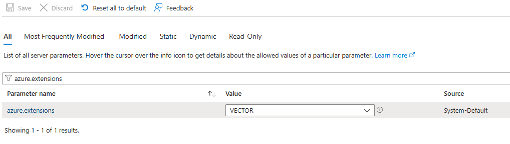

Desde la terminal del portal de Azure vamos nos vamos a conectar a nuestro servidor y a habilitar la extensión pgvector (**IMPORTANTE**):
```bash
psql -h <AZURE_HOST_NAME> -p 5432 -U <AZURE_ADMIN> -d <NOMBRE_DB_AZURE>

CREATE EXTENSION vector;
```


### 4. IMPORTAR LA BASE DE DATOS A AZURE (pg_restore)

Utiliza pg_restore para cargar el archivo .dump en la base de datos de Azure (*esto se hace desde la terminal en local no desde Azure*).

COMANDO DE IMPORTACIÓN:

```bash
    <RUTA_A_PG_RESTORE> -h <AZURE_HOST_NAME> -p 5432 -U <AZURE_ADMIN> -d <NOMBRE_DB_AZURE> -v "<RUTA_ABSOLUTA_AL_DUMP>"
```
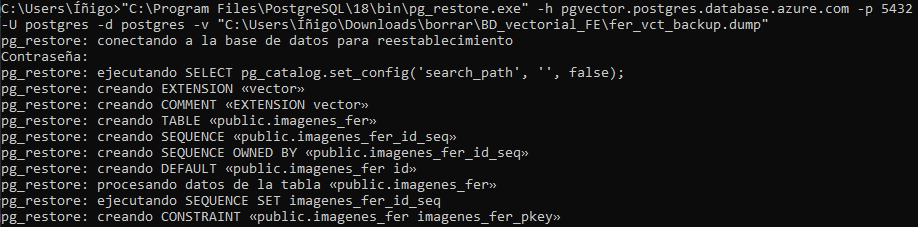

### 5. VERIFICACIÓN

Conéctate a la DB de Azure para confirmar la migración. Esto lo podemos hacer o desde la shell de Azure o podemos conectarnos desde PostgreSQL en local, con la ruta de Azure.

Verificar conteo de filas:
```sql
SELECT COUNT(*) FROM imagenes_fer;
```

## 3. Orquestación y Procesamiento (Azure Data Factory)

Esta fase utiliza Azure Data Factory (ADF) como la herramienta de orquestación y movimiento de datos (ELT). ADF es responsable de extraer los embeddings vectoriales desde la base de datos PostgreSQL en Azure y cargarlos en el Data Lakehouse (Azure Data Lake Storage Gen2), sirviendo como el motor de la "T" (Transformación/Movimiento) y la "L" (Carga).

---
### IMPORTANTE: MIGRACIÓN DE IMÁGENES A LA NUBE (AZURE BLOB STORAGE)

Este es un paso manual o con script que se realiza una sola vez para mover las 28,000 imágenes desde tu PC local a un servicio de almacenamiento en la nube de Azure.

1.  **CREAR UN RECURSO DE ALMACENAMIENTO:** En el Portal de Azure, crea una nueva **"Storage account"** (Cuenta de Almacenamiento) si aún no tienes una separada para archivos temporales (Nota: puedes usar la misma cuenta de tu Data Lakehouse, pero es mejor separarla para claridad).
2.  **CREAR UN CONTENEDOR:** Dentro de esa cuenta de almacenamiento (o tu cuenta de Data Lakehouse ADLS Gen2), crea un **"Container"** (Contenedor) para las imágenes de origen (ej., **`origen-imagenes-fer`**).
3.  **SUBIR LAS IMÁGENES:** Sube las carpetas del dataset FER2013 (la carpeta `train/` con sus subcarpetas de emociones) a este nuevo contenedor. Puedes usar herramientas como:
    * **Azure Storage Explorer (Recomendado):** Es una aplicación gratuita de Microsoft que permite arrastrar y soltar carpetas enteras a Azure Blob Storage, manteniendo la jerarquía.
    * **Azure CLI:** Usando el comando `az storage blob upload-batch`.

Una vez que las imágenes están en la nube, el flujo ETL se vuelve nativo de Azure.

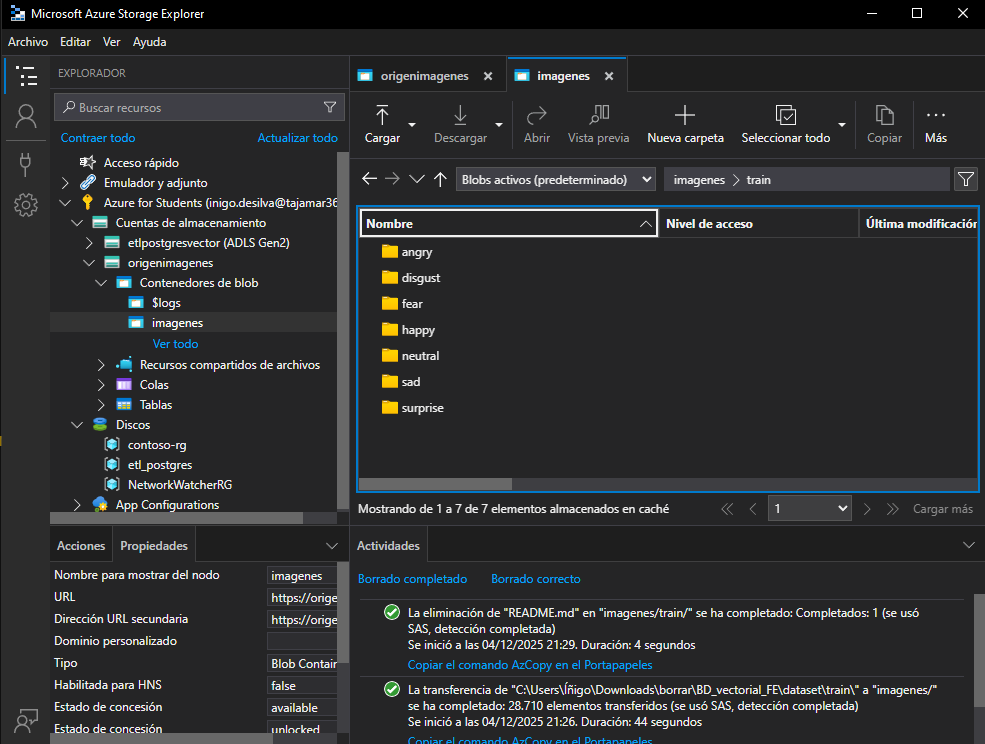

---

### 3.1. Creación del Data Lakehouse

El Data Lakehouse se implementa utilizando **Azure Data Lake Storage Gen2 (ADLS Gen2)**, que proporciona el almacenamiento escalable y las capacidades de sistema de archivos necesarias para alojar los embeddings vectoriales en formato Parquet.

1.  **Creación de la Storage Account:**
    * En el Portal de Azure, se crea un recurso de **"Storage account"** .
    * Se selecciona la misma región y grupo de recursos utilizados para Azure PostgreSQL y Azure Data Factory para optimizar el rendimiento y la latencia.
    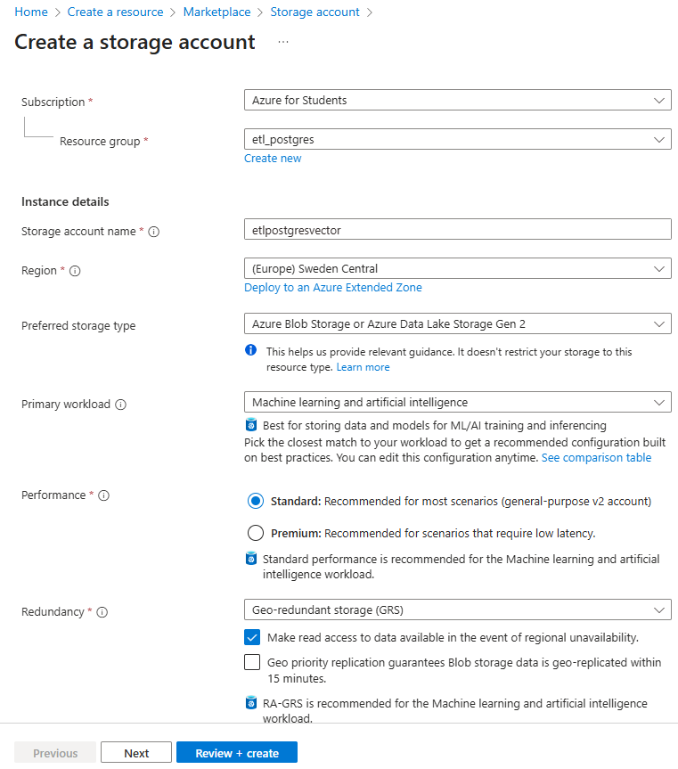

2.  **Habilitación de Namespace Jerárquico (Configuración de Data Lake):**
    * **Paso Crucial:** Durante la configuración, se debe navegar a la pestaña **"Advanced"** (Opciones avanzadas).
    * En la sección **"Data Lake Storage Gen2"**, se habilita la opción **"Hierarchical namespace"** (Espacio de nombres jerárquico). Esta característica es esencial, ya que permite la gestión de directorios y archivos de manera eficiente, replicando la estructura de un sistema de archivos tradicional, lo que define el componente Data Lakehouse.
    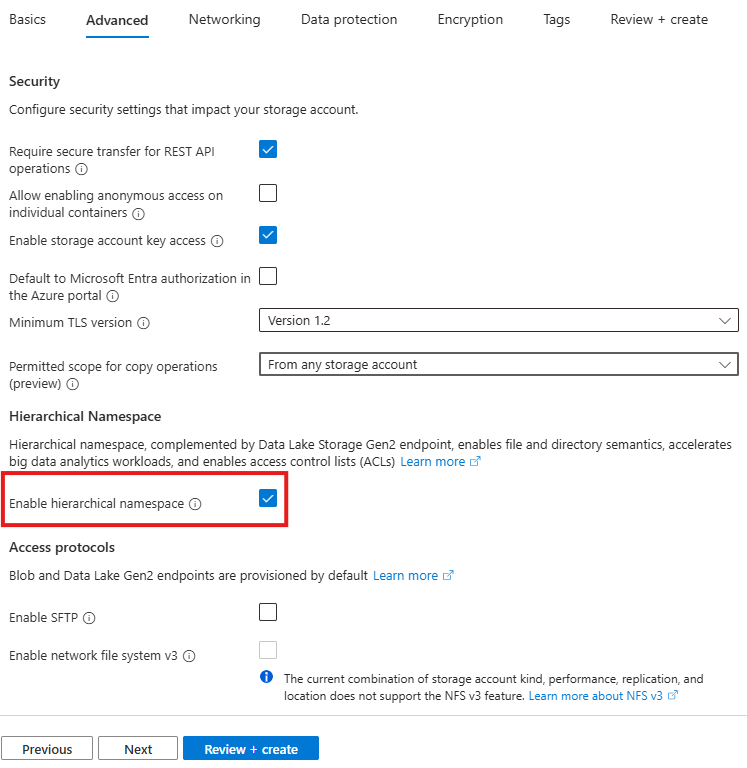

3.  **Organización de Contenedores:**
    * Una vez creada la cuenta, se establece una estructura lógica dentro de un contenedor (ej., 'raw' o 'landing').
    * Azure Data Factory (ADF) cargará los archivos Parquet en esta ubicación, manteniendo la estructura de carpetas definida en el Dataset de destino (ej., 'raw/embeddings/fer2013/').


### 3.2. Creación del Servicio Azure Data Factory (ADF)

1.  **Creación del Recurso ADF:** En el Portal de Azure, se crea un nuevo recurso de **Data Factory (V2)**. Se recomienda usar la misma región que Azure PostgreSQL y el Data Lakehouse para reducir la latencia.

    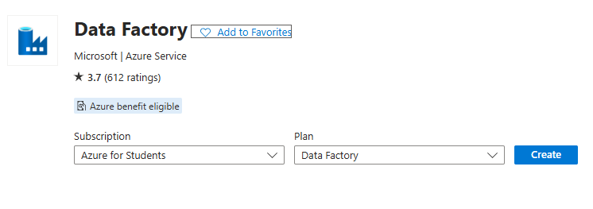
    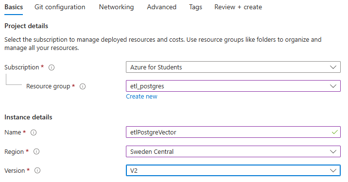

2.  **Acceso al Studio:** Una vez desplegado, se accede al **Azure Data Factory Studio** para comenzar la configuración.

### 3.3. Configuración de Conexiones (Linked Services)

Dentro del ADF Studio, se configuran las conexiones a los almacenes de datos. Esto se realiza en la sección "Manage" (Administrar, icono del enchufe) de ADF Studio.

1.  **Linked Service para Azure PostgreSQL (Origen):**
    * **Tipo:** Azure Database for PostgreSQL.
    * **Propósito:** Permite a ADF leer los datos vectoriales de la tabla 'imagenes_fer'.
    * **Configuración en ADF:**
        * Se selecciona el tipo Azure Database for PostgreSQL.
        * Se introducen los parámetros de conexión del servidor Flexible Server: Host Name, Database name (ej., 'fer_vct'), User name (<AZURE_ADMIN>), y Password, tal como se configuraron en el Paso 2.
        * Es obligatorio realizar una prueba de conexión (Test connection) antes de crear el servicio.

    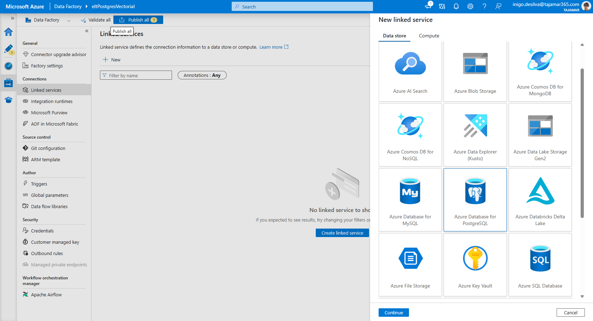
    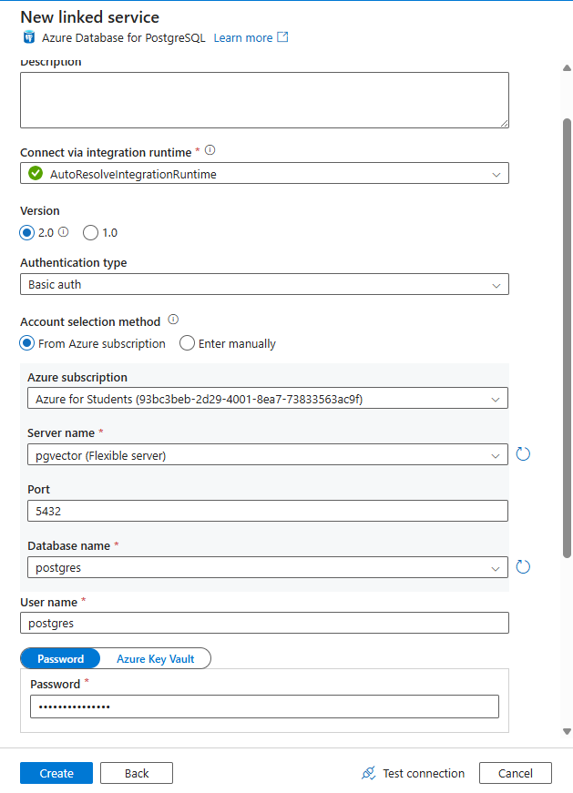

2.  **Linked Service para Data Lakehouse (Destino):**
    * **Tipo:** Azure Data Lake Storage Gen2 (ADLS Gen2).
    * **Propósito:** Permite a ADF escribir los archivos Parquet resultantes en el Data Lake.
    * **Configuración en ADF:**
        * Se selecciona el tipo Azure Data Lake Storage Gen2.
        * Se elige la Cuenta de Almacenamiento (Storage account name) correspondiente a tu Data Lakehouse.
        * Se recomienda usar la Identidad Administrada (Managed Identity) para la autenticación por motivos de seguridad.
        * Se verifica la conexión y se crea el servicio.

    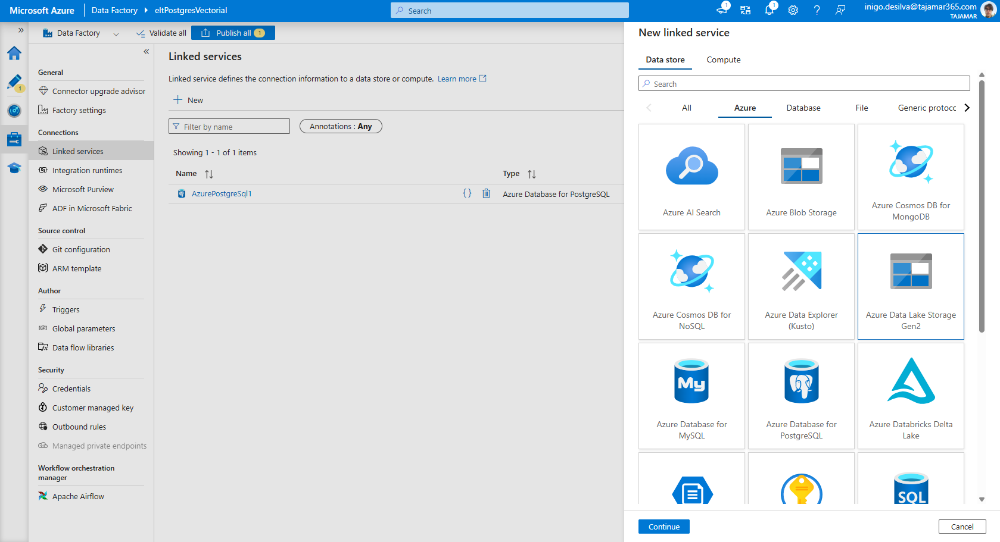
    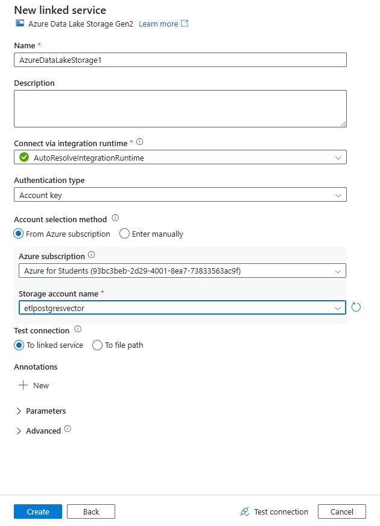

3.  **Linked Service para Azure Blob Storage (Origen Imágenes - Cloud):**
    * **Tipo:** Azure Blob Storage.
    * **Propósito:** Es la fuente de los archivos binarios de imagen una vez cargados a la nube, eliminando el uso del SHIR.
    * **Configuración en ADF:**
        * Se selecciona el tipo Azure Blob Storage.
        * Se elige la Cuenta de Almacenamiento donde se cargaron las imágenes.
        * **Integration Runtime:** Se selecciona el **AutoResolveIntegrationRuntime** (o el predeterminado) para una conexión directa en la nube.
        * La conexión se realiza directamente en la nube.

    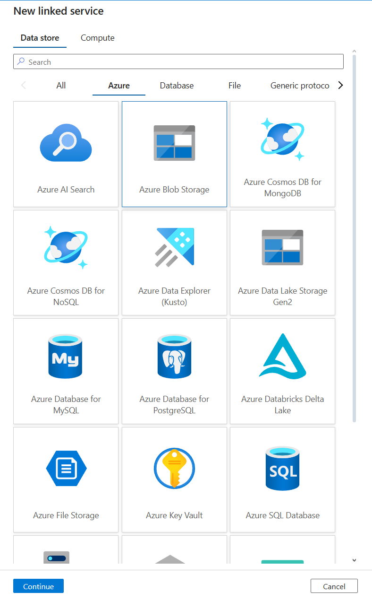
    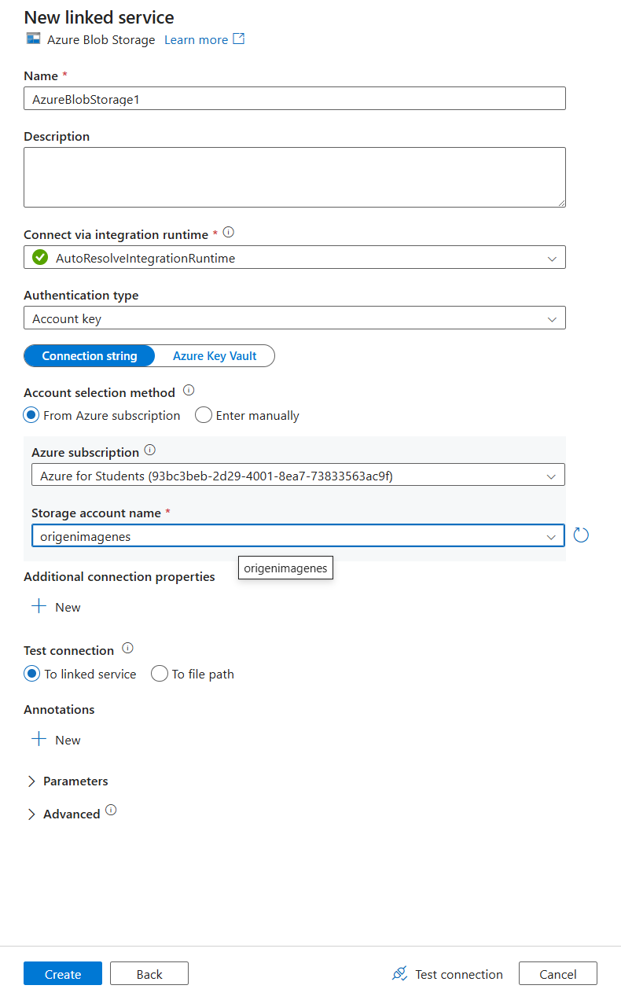
   

### 3.4. Definición de Datasets

Los Datasets apuntan a los datos específicos dentro de las conexiones definidas. Para manejar los dos flujos de datos (embeddings desde la nube y binarios desde local) se requieren cuatro Datasets.

La configuración de estos Datasets se realiza dentro del Azure Data Factory Studio en la sección "Author" (Autor).

1.  **Dataset de Origen (DS_PgVector_ImagenesFer):**
    * **Propósito:** Apunta a la tabla 'imagenes_fer' en Azure PostgreSQL (para extraer los embeddings).
    * **Configuración en ADF:**
        * Tipo: Azure Database for PostgreSQL.
        * Linked Service: Se enlaza al servicio de PostgreSQL configurado en 3.2.1.
        * Tabla: Se selecciona la tabla 'imagenes_fer'.
    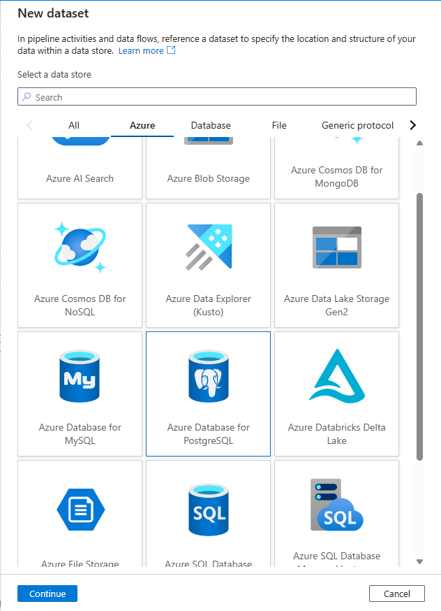
    


2.  **Dataset de Destino (DS_Lakehouse_Embeddings):**
    * **Propósito:** Define la ubicación y el formato para los embeddings en el Data Lakehouse.
    * **Configuración en ADF:**
        * Tipo: Azure Data Lake Storage Gen2.
        * Formato: Se selecciona **Parquet** por ser columnar y optimizado para análisis.
        * Linked Service: Se enlaza al servicio de ADLS Gen2 configurado en 3.2.2.
        * Ruta de Archivo: Se especifica la ruta lógica (ej., 'raw/embeddings/fer2013/').
    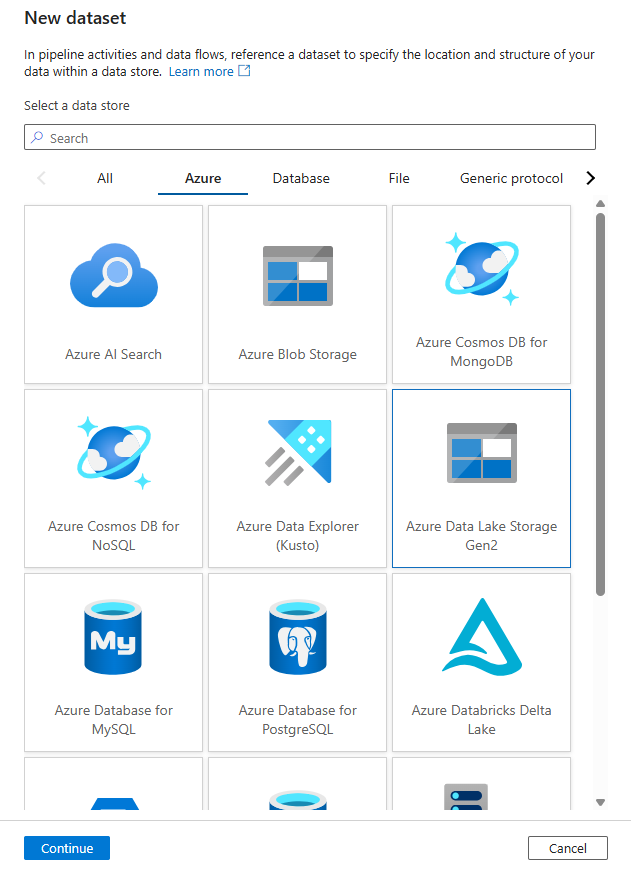
    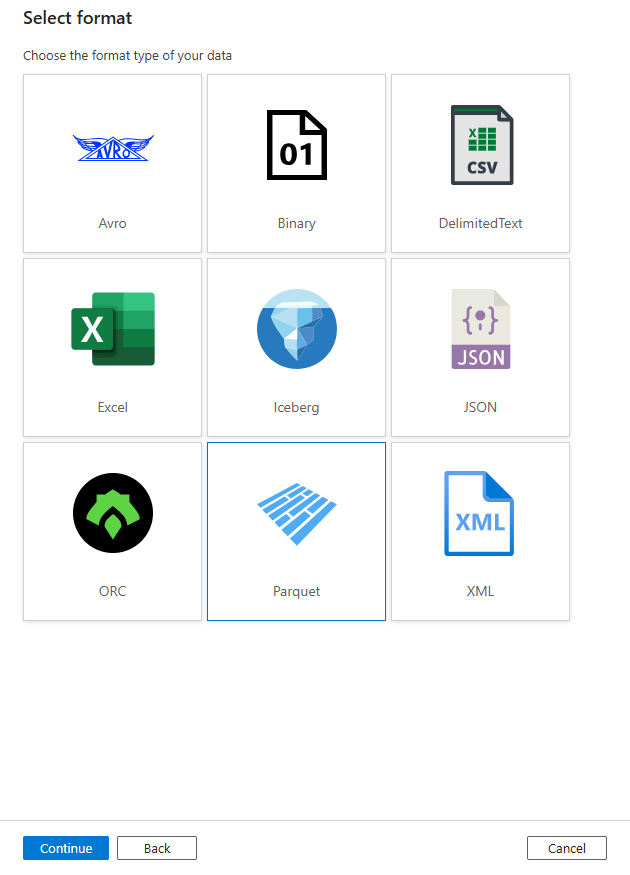
    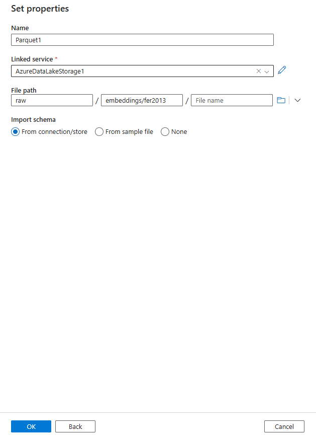

3.  **Dataset de Origen Binario (DS_Images_Source):**
    * **Propósito:** Apunta a la ubicación de los archivos PNG del dataset FER2013 en **Azure Blob Storage**, asumiendo que ya han sido cargados.
    * **Configuración en ADF:**
        * Tipo: **Azure Blob Storage**.
        * Linked Service: Se enlaza al nuevo Linked Service de **Azure Blob Storage** configurado en 3.2.3.
        * Formato: Se selecciona **Binary** (Binario) para tratar los archivos sin modificar su contenido.
        * Ruta: Se indica la subcarpeta dentro del contenedor de Blob Storage donde se encuentran las imágenes (ej., 'train').

    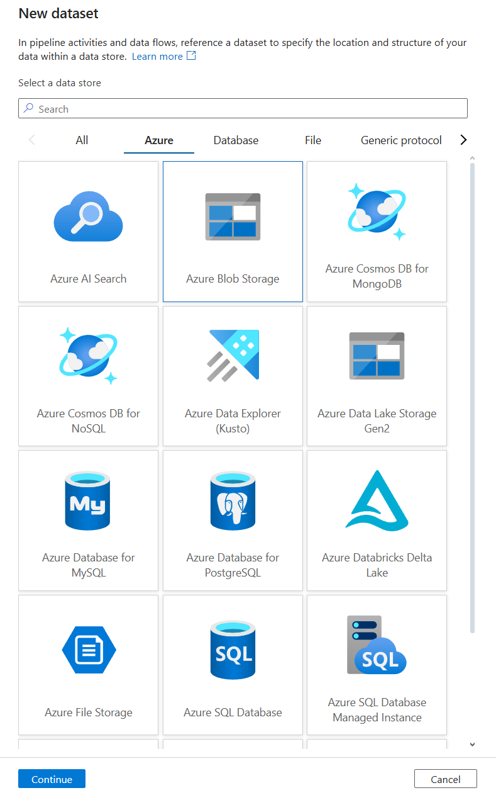
    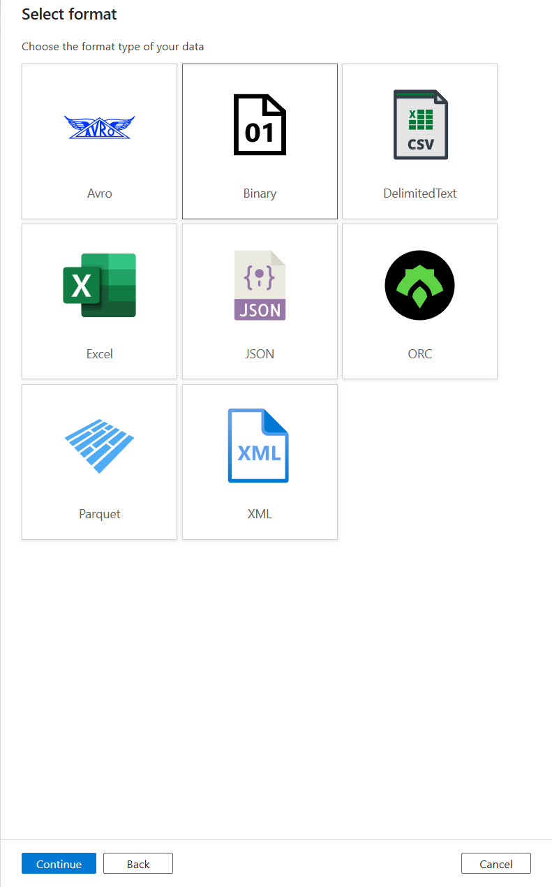
    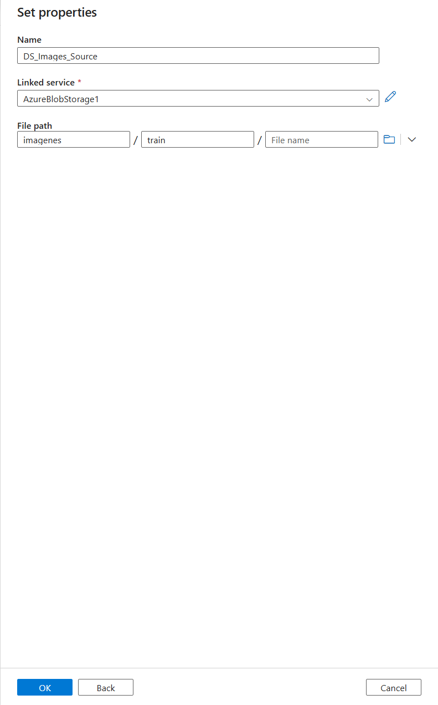

4.  **Dataset de Destino Binario (DS_Lakehouse_Images):**
    * **Propósito:** Define la ubicación para las imágenes originales sin alteración en el Data Lakehouse.
    * **Configuración en ADF:**
        * Tipo: Azure Data Lake Storage Gen2.
        * Formato: Se selecciona **Binary** (Binario).
        * Linked Service: Se enlaza al servicio de ADLS Gen2.
        * Ruta de Archivo: Se especifica una ruta para las imágenes (ej., 'raw/images/fer2013/') separada de los embeddings.

    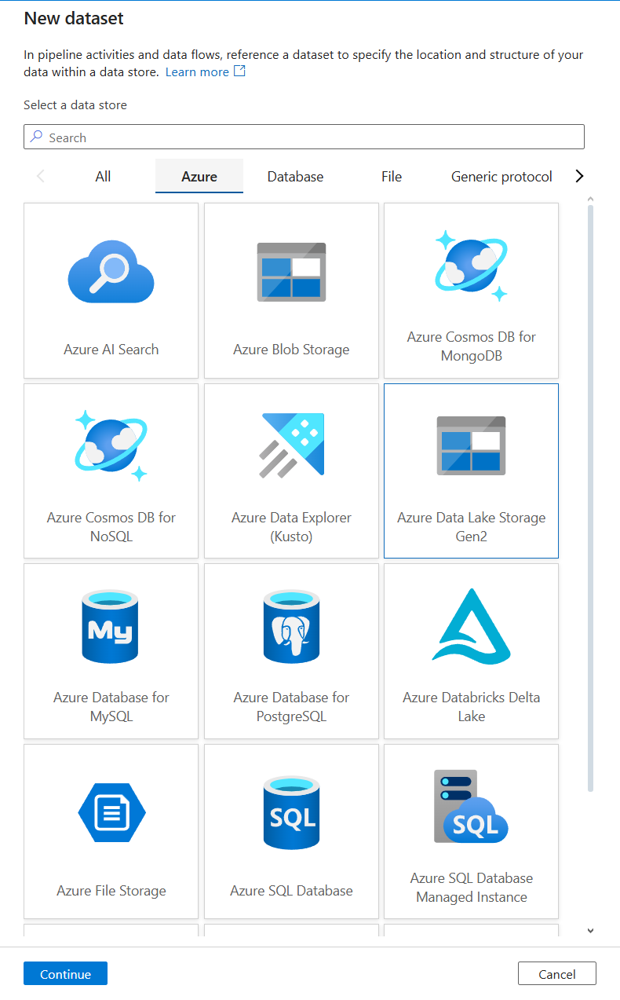
    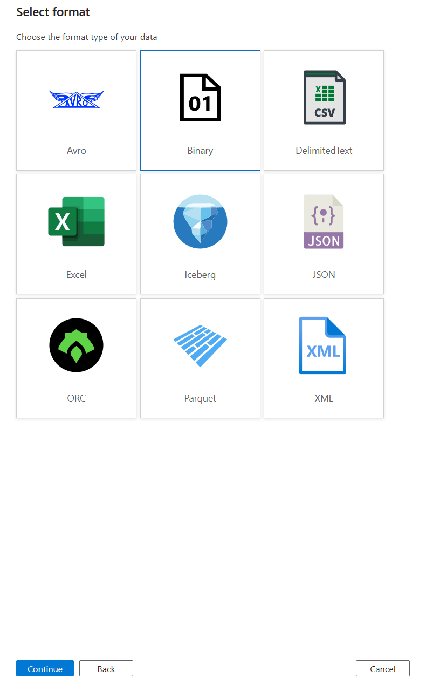
    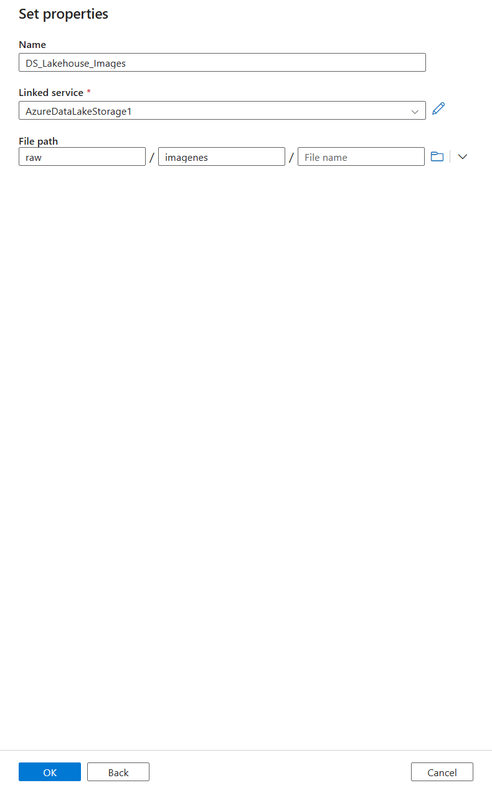

### 3.5. Creación del Pipeline de Carga (Copy Data Activity)

El Pipeline (ej., `PL_Migrar_Datos_FER`) debe orquestar dos tareas de copia distintas y paralelas para manejar los dos tipos de datos desde sus orígenes en la nube hasta el Data Lakehouse (ADLS Gen2).

1.  **Crear Pipeline:** Se crea un nuevo Pipeline en ADF Studio (ej., `PL_Migrar_Datos_FER`).
2.  **Añadir Dos Actividades de Copia de Datos:** Se incluyen dos actividades de *Copy Data* independientes.

#### 1. Flujo de Embeddings (PostgreSQL a Parquet)

Esta actividad traslada los vectores numéricos y metadatos desde la base de datos a un formato analítico optimizado, corrigiendo dinámicamente la ruta del archivo (filepath) para que coincida con la ubicación final de las imágenes en el Data Lakehouse.

* **Nombre de Actividad:** `Copy_Embeddings_PostgreSQL`
* **Configuración de Origen (Source):** Se utiliza el Dataset de origen (`DS_PgVector_ImagenesFer`), pero debes cambiar el modo de extracción de **"Table"** a **"Query"**.
* **Consulta SQL de Extracción (Transformación de Ruta):**
    * Introduce la siguiente consulta en el campo "Query". Esta consulta concatena el prefijo de la ruta y le da un alias (`filepath_corregido`) a la columna resultante.
    ```sql
    SELECT
        id,
        emotion,
        vector,
        -- CAMBIO CLAVE: Concatena el prefijo de la ruta del Data Lakehouse
        'raw/imagenes/train/' || filepath AS filepath
    FROM
        public.imagenes_fer;
    ```
* **Configuración de Destino (Sink):** Se utiliza el Dataset de destino (`DS_Lakehouse_Embeddings`) configurado con el formato **Parquet**.
* **Manejo de Vectores:** ADF gestiona la conversión de la columna `VECTOR(512)` de PostgreSQL en un tipo de dato compatible (como una *array* o *string* serializada) dentro del archivo Parquet.
* **Mapeo (Mapping):** Dentro de la actividad Copy Data, ve a la pestaña "Mapping" y asegúrate de que la columna de origen **`filepath_corregido`** (generada por la consulta SQL) se mapee correctamente a la columna destino **`filepath`** del archivo Parquet.

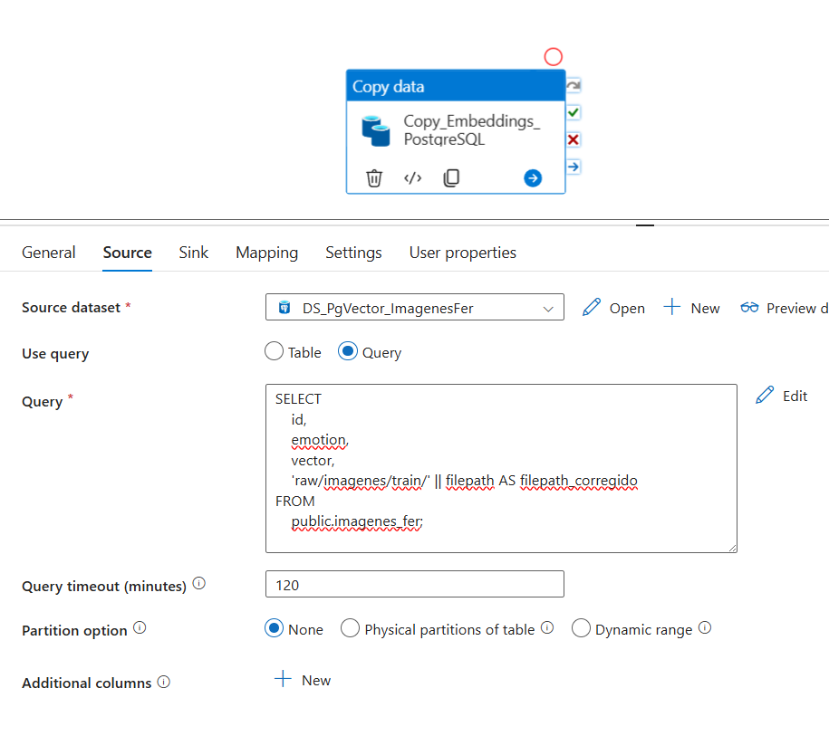

#### 2. Flujo de Imágenes (Blob Storage a Binary)

Esta actividad traslada los archivos de imagen binarios sin alteración a la zona de datos crudos (raw) del Data Lakehouse.

* **Nombre de Actividad:** `Copy_Images_BlobStorage`
* **Configuración de Origen (Source):** Se utiliza el Dataset de origen binario (`DS_Images_Source`), conectado al Linked Service de Azure Blob Storage (3.2.3).
* **Configuración de Destino (Sink):** Se utiliza el Dataset de destino binario (`DS_Lakehouse_Images`) configurado con el formato **Binary**.
* **Comportamiento de Copia:** Es crucial configurar esta actividad para que preserve la jerarquía de las carpetas, **`Preserve hierarchy`** (ej., `train/feliz/`) al copiar de Blob Storage al Data Lakehouse, garantizando que los `filepaths` de los embeddings sigan siendo válidos.

### 3.6. Ejecución y Monitoreo

Esta fase valida la corrección de rutas, la conexión Cloud-to-Cloud y el éxito del traslado de datos vectoriales y binarios al Data Lakehouse.


#### 1. Verificación del Flujo (Modo Debug)

* **Propósito:** Asegurar que ambas actividades de copia (`Copy_Embeddings_PostgreSQL` y `Copy_Images_BlobStorage`) se ejecuten sin errores.
* **Ejecución:** Inicia el Pipeline en modo **"Debug"** (Depurar) para una prueba de validación.
* **Validación de Embeddings:** Confirma el estado "Succeeded" y verifica en los detalles que el **número de filas leídas** de PostgreSQL sea correcto. Esto valida que la **Source Query** que corrige el `filepath` funciona.
* **Validación de Imágenes:** Confirma el estado "Succeeded" y verifica el **volumen de datos (Bytes)** copiados de Azure Blob Storage. Esto valida que la conexión Cloud-to-Cloud es exitosa.

    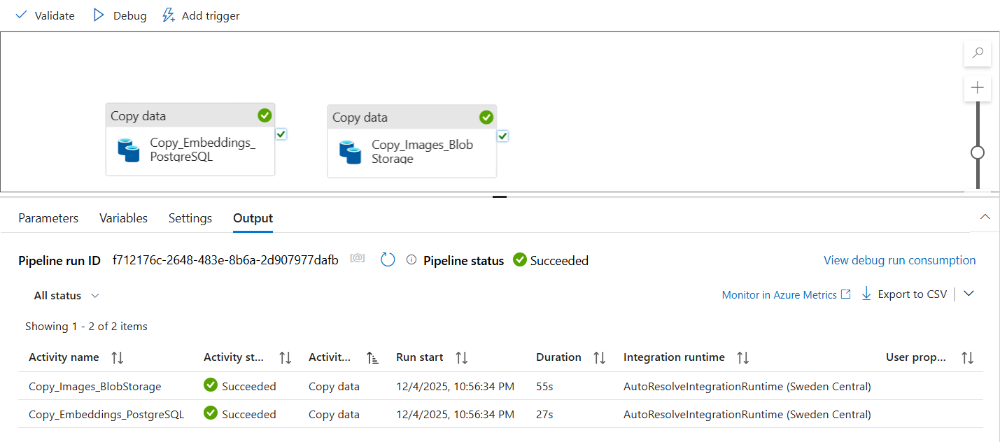

#### 2. Programación de la Carga (Triggers)

* **Publicación:** Haz clic en **"Publish all"** (Publicar todo) antes de programar la ejecución.
* **Trigger:** Vamos a ir a **"Add Trigger"** y le vamos a dar clic a **"Trigger Now"**


#### 3. Monitoreo y Validación de Destino

* **Panel de Monitoreo:** En la pestaña "Monitor" de ADF, revisa el estado de la ejecución (debe ser **"Succeeded"**).
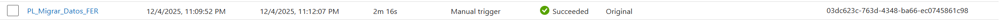
* **Validación de Destino (ADLS Gen2):**
    * Verifica que los archivos **Parquet** (Embeddings) se hayan creado en la ruta: `raw/embeddings/fer2013/`.
    * Verifica que los archivos **Binarios** (Imágenes) se hayan creado en la ruta: `raw/images/fer2013/train/` y que se haya **mantenido la jerarquía de las carpetas de emoción** (gracias a la configuración 'Preserve hierarchy').


## 4. Conexion de Microsoft AI Foundry al Datalake

Esta es la fase final, donde los datos vectoriales (embeddings) y las imágenes binarias se utilizan para construir aplicaciones de Inteligencia Artificial.


### 1. Desplegar Microsoft AI Foundry


El despliegue de **Microsoft AI Foundry** (o el servicio específico de Azure AI) consiste en configurar el entorno para acceder y procesar los datos en el Data Lakehouse.

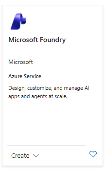

* **Configuración del Acceso:** El servicio Foundry se configura con acceso de lectura directo al **Data Lakehouse (ADLS Gen2)** para obtener los datos.
* **Indexación:** Los **vectores** leídos desde los archivos Parquet (`raw/embeddings/fer2013/`) se cargan en un índice vectorial optimizado (ej., Azure AI Search o un índice vectorial nativo de Foundry). Esto permite realizar consultas de similitud ultrarrápidas, que son esenciales para el consumo de embeddings.

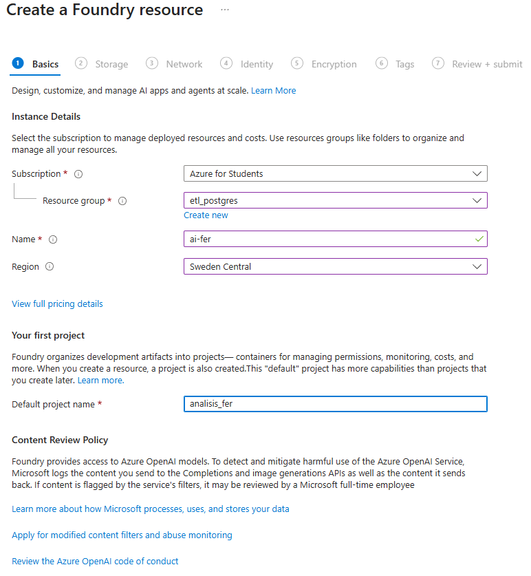

Para conectar con nuestro Datalake vamos a ir a `Centro de Administración`, `Connected resources`, seleccionamos `Nueva conexión`.

Busca y selecciona el tipo de conexión apropiado, como Storage account (Cuenta de almacenamiento).

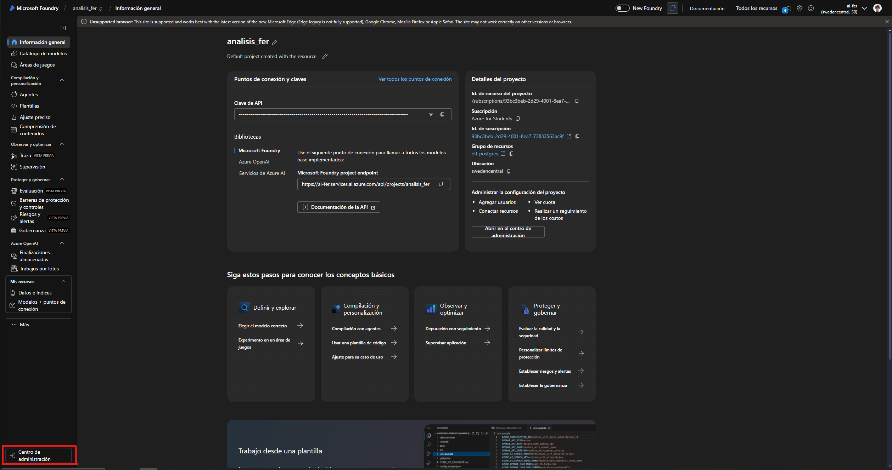


